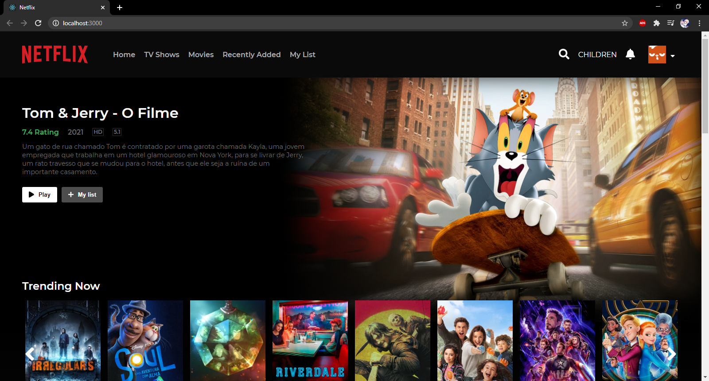

*Netflix without movies*

# First time using react and api rest

This is my co-first react app and also my fist time using an api rest, hope i can finish this :D

## Some tech used

I'm using axios, .env, font-awesome, node-sass, and react router (with its dependencys)

**API**
I'm using TMDB (The movie database), an api that let me get movie info for free and without limits
Thanks TMDB for existing! :D

### Run it

React default commands, 'npm start'

### To do
Some things that i wanna have on this project

- [] Header
    - [x] Link nav
    - [] Search Bar
    - [] Change Profile pic
    - [] Show Totifications

- [x] Home Page
    - [x] Random selected movie with some desc
    - [x] React Component that returns movies when receiving params
    - [x] Top 10

- [] Movie & Series
    - [] Auto selected random movies & Series

- [] My List
    - [] Not shure if im doing it, but if im goint to add a back-end to save movie and show them on this route

- [] Player
    - [] Make an styled player that do absolutely nothing

- [] Info
    - [] Show movie img
    - [] Show movie info
    - [] Play button

- [] Mobile
    - [] Responsive Components
    - [] Menu (Sandwich & Profile)

